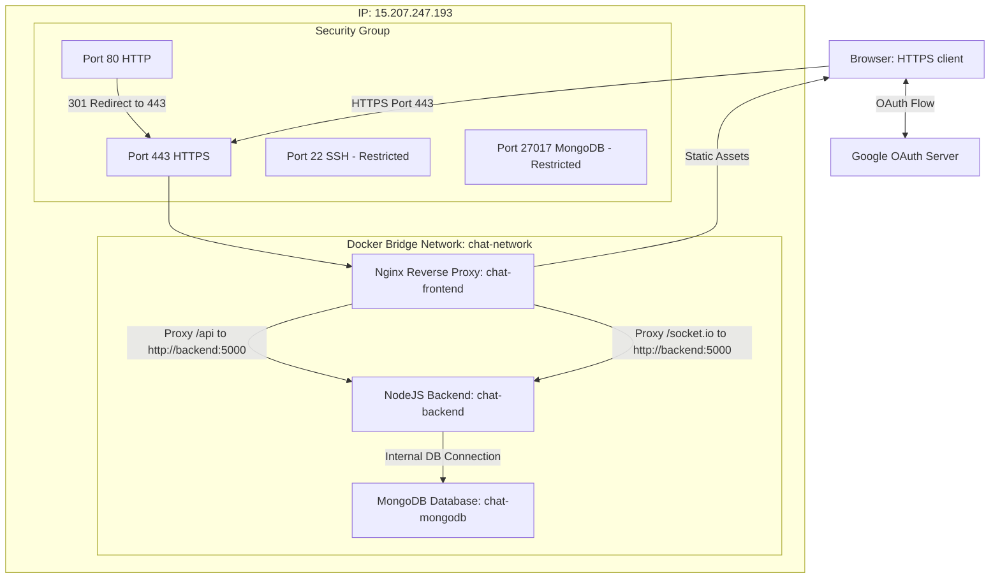

# AWS EC2 & Docker MERN Stack Deployment Playbook
This playbook details the architecture, configuration steps, and maintenance commands used to deploy OrbitChat—a full-stack MERN application—to a secure, production-grade AWS EC2 environment using Docker, Nginx, Let's Encrypt (Certbot), and Google OAuth.

---

## 1. System Architecture
Our production architecture is built to be secure, isolated, and easy to maintain. 



### Key Design Details:
* **Nginx Reverse Proxy**: Acts as the single entry point. It terminates SSL (HTTPS), serves static React files, and proxies API/Socket requests internally to the Node container.
* **Network Isolation**: The backend database and server ports (5000, 27017) are hidden from the public internet. Only Nginx is exposed publicly via port 80/443.
* **Volume Persistence**: MongoDB data is saved in a managed Docker volume (`mongo-data`) so data is never lost when containers are stopped or updated.

---

## 2. Step-by-Step Deployment Journey

### Step 2.1: Prepare AWS EC2 Instance
1. Launch an Ubuntu 24.04 instance (`t2.micro` is sufficient).
2. Configure **Security Group** Inbound Rules:
   * **SSH (Port 22)**: Set to `My IP` (for terminal access safety).
   * **HTTP (Port 80)**: Set to `Anywhere (0.0.0.0/0)` (for Certbot & HTTP redirects).
   * **HTTPS (Port 443)**: Set to `Anywhere (0.0.0.0/0)` (for secure web traffic).

### Step 2.2: Install Docker and Docker Compose
Log in via SSH and install Docker:
```bash
sudo apt-get update
sudo apt-get install -y docker.io docker-compose-v2
sudo usermod -aG docker ubuntu
# Log out and log back in for group changes to take effect
```

### Step 2.3: Set Up a Free Domain & Generate SSL Certificates
Because Google OAuth requires HTTPS and a valid domain name, we use `sslip.io` (a free service mapping IPs to subdomains without signup).
1. Stop running containers to free up Port 80:
   ```bash
   sudo docker compose down
   ```
2. Install Certbot:
   ```bash
   sudo apt-get install -y certbot
   ```
3. Generate the SSL certificate for your hyphenated IP domain:
   ```bash
   sudo certbot certonly --standalone -d 15-207-247-193.sslip.io
   ```
   *Certbot will save the certificate files to `/etc/letsencrypt/live/15-207-247-193.sslip.io/`.*

### Step 2.4: Configure Environment Variables
Create a `.env` file in the root folder of your project on the EC2 server:
```env
VITE_BACKEND_URL=https://15-207-247-193.sslip.io
VITE_GOOGLE_CLIENT_ID=your-google-client-id-here.apps.googleusercontent.com
```

### Step 2.5: Configure Google OAuth
Go to [Google Cloud Console Credentials](https://console.cloud.google.com/apis/credentials) and update your Client ID:
* **Authorized JavaScript origins**: `https://15-207-247-193.sslip.io`
* **Authorized redirect URIs**: `https://15-207-247-193.sslip.io`

---

## 3. Maintenance & Monitoring Playbook

Here are the essential commands you will need to manage, update, and monitor your application.

### Container Orchestration
| Task | Command |
| :--- | :--- |
| **Start Stack (Detached)** | `sudo docker compose up -d` |
| **Stop Stack** | `sudo docker compose down` |
| **View Running Containers** | `sudo docker compose ps` |
| **Force Full Rebuild (Clean)** | `sudo docker compose build --no-cache` |
| **Rebuild Frontend Only** | `sudo docker compose build --no-cache frontend` |

### Troubleshooting & Logs
| Task | Command |
| :--- | :--- |
| **View All Container Logs** | `sudo docker compose logs -f` |
| **View Node Backend Logs** | `sudo docker compose logs -f backend` |
| **View Nginx Frontend Logs** | `sudo docker compose logs -f frontend` |
| **View MongoDB Logs** | `sudo docker compose logs -f mongodb` |

### Database Administration (MongoDB)
* **Open Database Console (mongosh)**:
  ```bash
  sudo docker exec -it chat-mongodb mongosh
  ```
  Once inside:
  ```javascript
  use realtime-chatapp      // Switch to your database
  show collections          // List all collections
  db.users.find().pretty()  // List registered users
  exit                      // Exit MongoDB shell
  ```
* **Connect via MongoDB Compass GUI**:
  1. Open Port `27017` in your AWS EC2 Security Group, restricted to your **`My IP`**.
  2. Open MongoDB Compass on your laptop and connect to:
     `mongodb://15.207.247.193:27017`

---

## 4. Key Lessons & Dev-Ops Best Practices
1. **Docker Cache & React Builds**: Vite builds environment variables (`import.meta.env`) statically *during the docker build process*. If you change `.env`, you must rebuild the frontend container using `--no-cache` so the changes apply.
2. **Dashed sslip.io Subdomains**: Let's Encrypt does not allow multiple levels of subdomains for IP addresses (e.g., `15.207.247.193.sslip.io` will fail). Always use the hyphenated form `15-207-247-193.sslip.io` to request SSL certificates.
3. **Mounting SSL Certificates**: When mounting `/etc/letsencrypt` into Nginx, mount the entire directory (`/etc/letsencrypt:/etc/letsencrypt:ro`) instead of just the `/live` subdirectory. This ensures Nginx can resolve the internal symlinks pointing to the `/archive` folder.
