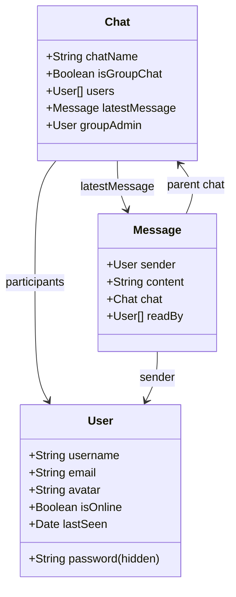
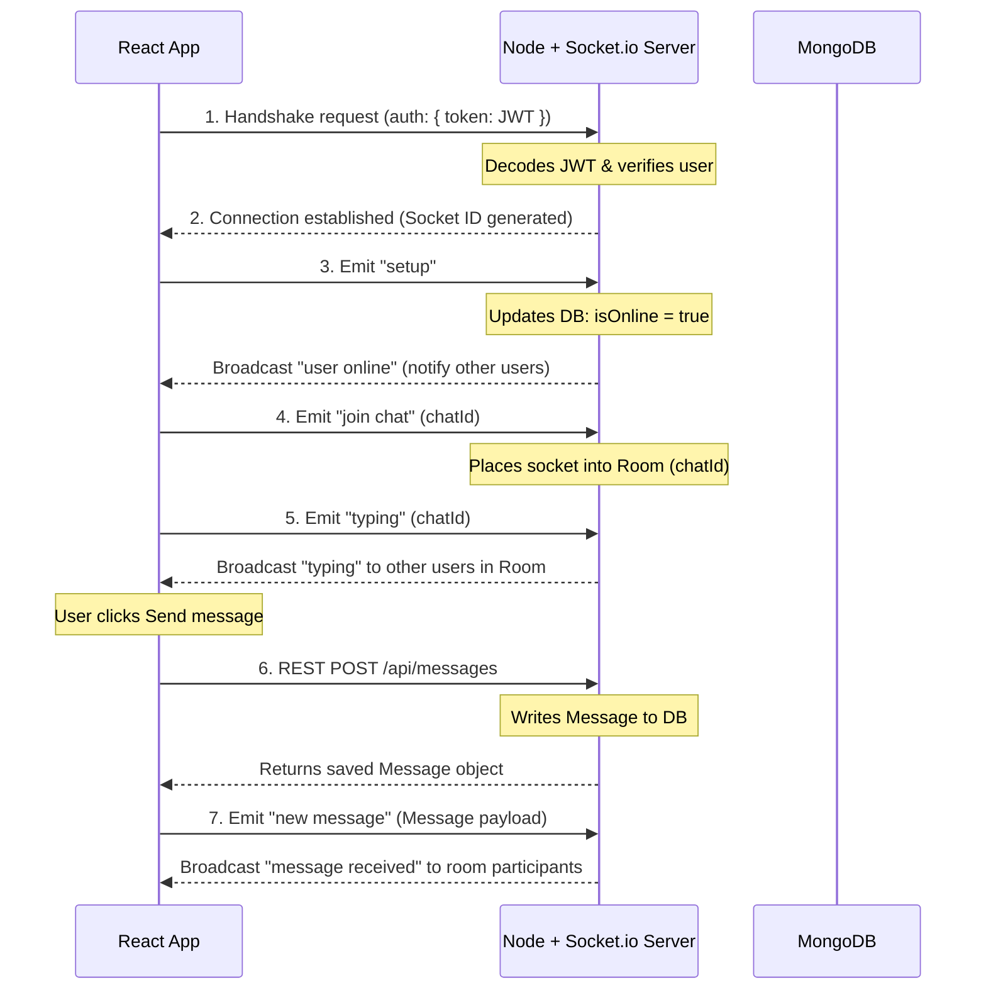

# OrbitChat: Full-Stack Real-Time Chat Application Guide

Welcome! This guide is designed to teach you the architecture of a production-ready, real-time chat application using **Node.js, Express, Socket.IO, JWT, and MongoDB (with Vite + React on the frontend)**. 

Since you have previously built an **E-Commerce REST application**, we will compare chat application patterns to E-commerce patterns throughout this guide. This will help you understand the architectural shifts and confidently explain them in interviews.

---

## Table of Contents
1. [E-Commerce vs. Real-Time Chat (Concept Comparison)](#1-e-commerce-vs-real-time-chat-concept-comparison)
2. [Folder Directory Structure](#2-folder-directory-structure)
3. [Database Schema Design (Mongoose)](#3-database-schema-design-mongoose)
4. [Step-by-Step Backend Setup & Code Breakdown](#4-step-by-step-backend-setup--code-breakdown)
5. [Step-by-Step Frontend Setup & Code Breakdown](#5-step-by-step-frontend-setup--code-breakdown)
6. [WebSockets: Event Lifecycle & Handshake Auth](#6-websockets-event-lifecycle--handshake-auth)
7. [Horizontal Scaling: Integrating Redis](#7-horizontal-scaling-integrating-redis)
8. [Dockerization & Deployment](#8-dockerization--deployment)
9. [Interview Q&A: Cracking the System Design Round](#9-interview-qa-cracking-the-system-design-round)

---

## 1. E-Commerce vs. Real-Time Chat (Concept Comparison)

| Dimension | E-Commerce System | Real-Time Chat System |
| :--- | :--- | :--- |
| **Protocol** | **HTTP/1.1 (Request-Response)**<br>Connection opens for request, server responds, connection closes immediately. | **WebSockets (TCP Handshake -> Persistent Connection)**<br>A single connection stays open indefinitely. Bidirectional data transfer. |
| **Data Pull vs. Push** | **Pull-based**<br>The client pulls data (e.g. browsing a product page or refreshing the cart status). | **Push-based**<br>The server pushes new data (e.g. incoming message, online status) to the recipient instantly. |
| **Authentication** | **HTTP Middleware**<br>Verified on each REST request via header `Authorization: Bearer <token>`. | **Double Layer**<br>1. REST HTTP requests use standard headers.<br>2. Socket connection setup validates token during **handshake**. |
| **Scaling** | **Stateless Scaling**<br>Spin up 10 servers behind a Load Balancer. Any server can handle any request since sessions are client-side (JWTs) or DB-backed. | **Stateful Scaling (Requires Redis Pub/Sub)**<br>Sockets are linked to specific servers. If User A is on Server 1 and User B is on Server 2, they cannot talk without a sync bus (Redis). |

---

## 2. Folder Directory Structure

Our project is split into `backend/` and `frontend/` folders. This separation makes it easy to Dockerize and deploy.

```text
realtime-chatapp/
├── backend/
│   ├── config/             # DB and Socket configurations
│   ├── controllers/        # REST controllers (Auth, Chats, Messages)
│   ├── middlewares/        # Authentication & global error handler
│   ├── models/             # Mongoose schemas (User, Chat, Message)
│   ├── routes/             # REST API routers
│   ├── socket/             # Socket.io event handler
│   ├── .env                # Port, MongoDB URI, JWT Secret
│   ├── Dockerfile          # Production Docker container setup
│   ├── server.js           # Server Entrypoint (Express + Socket.io bind)
│   └── package.json        
├── frontend/
│   ├── src/
│   │   ├── context/        # ChatContext (Holds user auth, chats, live sockets)
│   │   ├── pages/          # AuthPage & ChatPage
│   │   ├── index.css       # Global design system & animations
│   │   ├── App.jsx         # React routing router
│   │   └── main.jsx        # Mount point
│   ├── package.json
│   └── vite.config.js
└── docker-compose.yml      # Orchestrates Backend, Frontend, and Database
```

---

## 3. Database Schema Design (Mongoose)

### How it compares to E-Commerce:
- **E-Commerce**: You link `User` -> `Cart` -> `Product`. Products don't change state rapidly.
- **Chat**: You link `User` -> `Chat` (a room with participants) -> `Message`. Messages are written frequently and need rapid queries.



---

## 4. Step-by-Step Backend Setup & Code Breakdown

### Installation Commands
Run these inside the `backend/` directory:
```bash
# Create directory
mkdir backend
cd backend

# Initialize package
npm init -y

# Install production dependencies
npm install express socket.io mongoose jsonwebtoken bcryptjs dotenv cors

# Install dev dependencies
npm install --save-dev nodemon
```

### Core Code Architectures
1. **HTTP + WebSocket Binding (`server.js`)**:
   We bind Express and Socket.IO to a unified Node HTTP Server.
   ```javascript
   import http from 'http';
   import express from 'express';
   import { Server } from 'socket.io';
   
   const app = express();
   const server = http.createServer(app); // Bind Express
   const io = new Server(server);         // Bind Socket.io
   ```
2. **WebSocket Handshake Auth (`socket/socketHandler.js`)**:
   We intercepts connection requests and verifies the JWT before opening the socket.
   ```javascript
   io.use(async (socket, next) => {
     const token = socket.handshake.auth.token;
     const decoded = jwt.verify(token, process.env.JWT_SECRET);
     socket.user = await User.findById(decoded.id);
     next();
   });
   ```

---

## 5. Step-by-Step Frontend Setup & Code Breakdown

### Installation Commands
Run these from the root directory:
```bash
# Scaffold React app using Vite
npx -y create-vite@latest frontend --template react

# Navigate and install dependencies
cd frontend
npm install
npm install react-router-dom axios socket.io-client lucide-react
```

### Core Code Architectures
1. **Global Provider (`src/context/ChatContext.jsx`)**:
   Holds the authentication state and the persistent socket instance. When the user object changes (login/logout), it automatically manages the socket connection/disconnection.
2. **React Routing (`src/App.jsx`)**:
   Checks if the user exists in state. If not, blocks access to `/chats` and redirects to `/auth`.
3. **Typing Debounce (`src/pages/ChatPage.jsx`)**:
   Instead of emitting `typing` on every single keystroke, we use a debounce timer to stop the indicator after 2 seconds of inactivity:
   ```javascript
   const handleInputChange = (e) => {
     setNewMessage(e.target.value);
     socket.emit('typing', selectedChat._id);
     
     clearTimeout(typingTimeoutRef.current);
     typingTimeoutRef.current = setTimeout(() => {
       socket.emit('stop typing', selectedChat._id);
     }, 2000);
   };
   ```

---

## 6. WebSockets: Event Lifecycle & Handshake Auth

Here is the exact lifecycle of a WebSocket communication session in our app:



---

## 7. Horizontal Scaling: Integrating Redis

### The Problem (Horizontal Scaling)
If you deploy your chat app on AWS or Render and it gets popular, you will run more than one instance of your backend behind a Load Balancer (e.g., Instance A and Instance B).
- User A connects to **Instance A**.
- User B connects to **Instance B**.
- If User A sends a message to User B, Instance A has no idea User B is connected to Instance B! The message will never arrive.

### The Solution: Redis Adapter
By integrating `@socket.io/redis-adapter` and a Redis container:
1. Instance A publishes the message to a Redis Pub/Sub channel.
2. Instance B (which is subscribed to the same Redis channel) receives the message.
3. Instance B broadcasts the message to User B's open socket.

```text
[User A] -> (Instance A) -> [Redis Pub/Sub] -> (Instance B) -> [User B]
```

To implement this, you would run a Redis server and install the adapter package:
```bash
npm install @socket.io/redis-adapter redis
```
And update `backend/socket/socketHandler.js` to bind the Redis adapter to `io`.

---

## 8. Dockerization & Deployment (AWS EC2 & Docker Compose)

Using Docker Compose is the modern industry standard. It encapsulates your Node backend, React build (served via Nginx), and MongoDB database into self-contained virtual environments, meaning you can launch the entire stack on AWS with a single command.

### Phase 1: Provisioning the AWS EC2 Instance
1. **Sign in to AWS** and navigate to the **EC2 Dashboard**.
2. Click **Launch Instance** and configure:
   * **Name**: `OrbitChat-Server`
   * **OS (AMI)**: `Ubuntu Server 24.04 LTS` (Free Tier eligible).
   * **Instance Type**: `t2.micro` or `t3.micro` (Free Tier eligible).
   * **Key Pair**: Create a new `.pem` key pair and download it safely.
3. **Configure Security Group (Firewall)**:
   Add these Inbound Security Group Rules:
   * **SSH (Port 22)**: Allowed from `My IP` (for secure server access).
   * **HTTP (Port 80)**: Allowed from `Anywhere (0.0.0.0/0)` (Nginx serves our React frontend here).
   * **HTTPS (Port 443)**: Allowed from `Anywhere (0.0.0.0/0)` (for SSL encryption).
   * **Custom TCP (Port 5000)**: Optional (our Nginx container reverse-proxies this internally, so you don't need to open this to the public!).
4. Launch the instance.

### Phase 2: Installing Docker on the Ubuntu Instance
1. Open your terminal (or Git Bash) and SSH into your EC2 instance:
   ```bash
   ssh -i /path/to/your-key.pem ubuntu@<YOUR_EC2_PUBLIC_IP>
   ```
2. Update the OS package manager and install Docker + Docker Compose:
   ```bash
   sudo apt-get update
   sudo apt-get install -y docker.io docker-compose
   ```
3. Start the Docker service and enable it to run on boot:
   ```bash
   sudo systemctl start docker
   sudo systemctl enable docker
   ```
4. (Optional) Allow running Docker commands without prefixing `sudo`:
   ```bash
   sudo usermod -aG docker ubuntu
   # Exit and reconnect for changes to take effect
   exit
   ssh -i /path/to/your-key.pem ubuntu@<YOUR_EC2_PUBLIC_IP>
   ```

### Phase 3: Cloning and Launching the Application
1. Clone your project repository onto the EC2 server:
   ```bash
   git clone <YOUR_GIT_REPOSITORY_URL> realtime-chatapp
   cd realtime-chatapp
   ```
2. Create a global environment file `.env` in the root directory (`realtime-chatapp/.env`) to supply build-time arguments to Docker Compose:
   ```bash
   nano .env
   ```
   Paste the following parameters:
   ```env
   # Replace with your EC2 instance's Public IP or domain name
   VITE_BACKEND_URL=http://<YOUR_EC2_PUBLIC_IP>
   VITE_GOOGLE_CLIENT_ID=448322085675-mn74tf7b227dq6sqrj255cajc0gmiin9.apps.googleusercontent.com
   ```
   *(Press `Ctrl+O` then `Enter` to save, and `Ctrl+X` to exit nano)*.
3. Build and launch the containerized application stack in **detached mode** (runs in the background):
   ```bash
   docker-compose up --build -d
   ```
4. Verify your services are running successfully:
   ```bash
   docker-compose ps
   ```
   You should see `chat-frontend` (running Nginx on port 80), `chat-backend` (running Node on port 5000), and `chat-mongodb` active.
5. Open a browser and navigate to `http://<YOUR_EC2_PUBLIC_IP>`. Your production-ready app is live!

### Phase 4: Production Upgrades (Domain & SSL)
To move from `http` to `https` (required for features like Google Auth on production hosts):
1. **Point your Domain**: Map an `A` record in your DNS provider (GoDaddy, Namecheap, Route53) pointing `@` and `www` to your EC2 instance's Public IP.
2. **Install Certbot**: Connect to your EC2 instance and install Certbot:
   ```bash
   sudo apt-get install -y certbot
   ```
3. **Generate Certificates**: Request certificates from Let's Encrypt:
   ```bash
   sudo certbot certonly --standalone -d yourdomain.com -d www.yourdomain.com
   ```
4. **Link Certificates in Nginx**: Update `frontend/nginx.conf` (or map host certificate directories into the Nginx container volumes) to listen on port `443` and load the SSL certificate files (`fullchain.pem` and `privkey.pem`). Then rebuild using `docker-compose up -d --build`.

---

## 9. Interview Q&A: Cracking the System Design Round

Here are the most common interview questions about real-time chat apps, answered using our architecture:

### Q1: Why did you use WebSockets instead of HTTP Polling?
> **Answer**: HTTP Polling requires the client to request updates repeatedly (e.g., every 2 seconds). This wastes server resources and bandwidth since 90% of the requests return empty. WebSockets establish a single TCP connection, allowing the server to push messages instantly with zero overhead, reducing database reads and network load.

### Q2: How did you authenticate your WebSocket connection?
> **Answer**: I authenticated using a double-layered approach. REST APIs use standard JWT validation in Express headers. For WebSockets, I implemented a Socket.IO middleware that intercepts the handshake. The frontend sends the JWT in the `auth` payload during connection. The server decodes it, fetches the user, and attaches the user object directly to the socket context (`socket.user`). Connections with missing or invalid tokens are rejected.

### Q3: How do you handle typing indicators efficiently?
> **Answer**: Instead of sending a socket event for every single character typed (which creates heavy network traffic), I implemented a debounce mechanism. When a keystroke occurs, we emit a `typing` event. We then set a 2-second timer. If no new keystroke occurs within that time, we emit a `stop typing` event. If a keystroke occurs, we clear the timer and reset it.

### Q4: How would you scale this app to support millions of users?
> **Answer**: To scale, I would:
> 1. Run multiple backend instances behind an Application Load Balancer using sticky sessions (so handshakes route properly).
> 2. Link the socket servers using a **Redis Adapter** so events (like messages or typing indicators) are synchronized across instances.
> 3. Store online presence in a high-speed Redis Cache rather than writing status updates directly to MongoDB on every setup/disconnect event.

---

## 10. Setting up Google OAuth & Avatar Uploads

### A. Google OAuth Configuration
To make the Google Login button work with real Google credentials:
1. Go to the [Google Cloud Console](https://console.cloud.google.com/).
2. Create a new project, navigate to **APIs & Services** > **OAuth consent screen**, and set it up.
3. Go to **Credentials**, click **Create Credentials**, and select **OAuth client ID**.
4. Set the Application Type to **Web application** and add these URI configurations:
   - **Authorized JavaScript origins**: `http://localhost:5173` (your React frontend url)
   - **Authorized redirect URIs**: `http://localhost:5173`
5. Copy your generated **Client ID**.
6. Set the Client ID in your configuration:
   - **Backend**: Update `GOOGLE_CLIENT_ID` in `backend/.env`
   - **Frontend**: Update `VITE_GOOGLE_CLIENT_ID` in your frontend environment settings (or directly in `frontend/src/main.jsx`).

### B. Avatar Image Uploads Workflow
1. The frontend renders an `<input type="file" />` in the profile settings modal.
2. When a file is chosen, the React app sends a `multipart/form-data` request containing the binary image payload to the server's `POST /api/upload` endpoint.
3. The server uses **Multer** middleware to:
   - Validate that the file is an image (JPG, PNG, or WEBP).
   - Ensure the file is smaller than 2MB.
   - Write the file into the `/uploads` directory with a unique generated filename.
4. The server returns the relative file path to the frontend.
5. The frontend sends a `PUT /api/auth/profile` update to persist the new profile avatar URL in the database.

